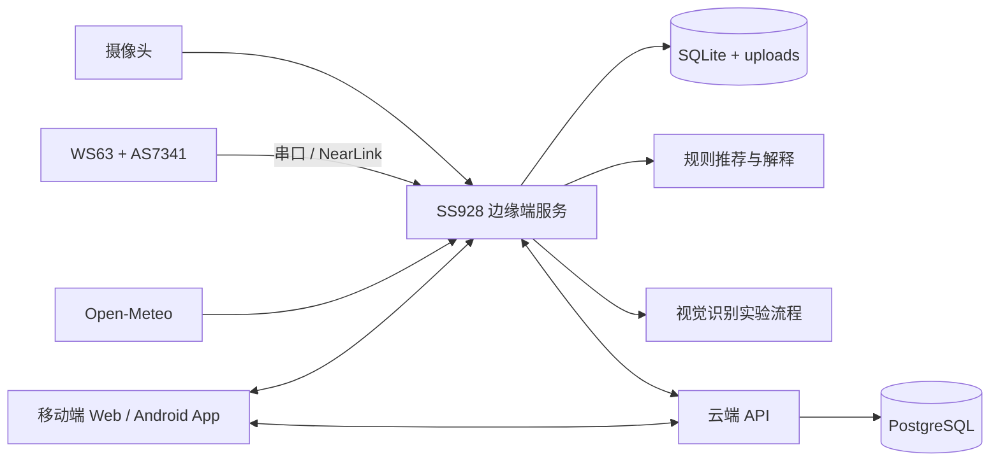

# 智能穿搭推荐平台

**Smart Wardrobe System** 是一个面向智能衣柜场景的可演示 MVP 原型，由移动端应用、SS928 边缘端服务、WS63 传感器节点和轻量云端后端组成。

系统已经实现衣物拍照入库、衣柜管理、天气与场景驱动的穿搭推荐、光谱传感器辅助材质判断以及云端同步。当前穿搭推荐采用可解释的规则打分与轻量特征匹配；计算机视觉用于辅助识别衣物类型，但由于现有视觉样本规模较小，识别结果仍需要用户审核和修正。

> 项目定位：面向嵌入式系统设计竞赛和功能演示的完整原型，不是已经训练并上线的生产级大模型推荐系统。

## 在线演示

- [在线播放智能衣柜项目演示视频](https://sakkaku1110.github.io/Intelligent-Outfit-Recommendation-Platform/)
- [直接打开或下载原视频](docs/assets/smart-wardrobe-demo.mp4)

## 项目亮点

- 移动端完成衣柜浏览、筛选、搜索、拍照入库、信息审核与编辑。
- SS928 负责摄像头采集、本地数据库、推荐算法、天气接入和传感器数据处理。
- WS63 可通过串口或 NearLink/星闪桥接 AS7341 光谱数据，为材质判断提供辅助信息。
- 推荐算法综合天气、场景、季节、保暖值、材质、偏好分、穿着次数和颜色协调度，并返回推荐理由。
- 云端后端支持衣物元数据与图片同步，移动端可以读取真实衣柜数据。
- 视觉实验工具支持样本采集、审核、标注、增强、评测和演示模型部署。

## 系统架构



## 已实现功能

### 1. 移动端衣柜管理

- 提供手机端 Web/App 界面，可打包为 Android APK。
- 查看已入库衣物及图片、名称、类别、颜色和材质等信息。
- 支持按类别筛选和关键词搜索。
- 支持新增、修改和删除衣物。

### 2. 衣物拍照入库

- SS928 调用摄像头采集衣物图片并生成信息草稿。
- 系统尝试分析衣物类别、颜色和材质等基础信息。
- 用户在移动端审核和修改识别结果后再保存入库。
- 衣物元数据保存在本地 SQLite，图片保存在本地 `uploads` 目录。

### 3. 衣物信息编辑

可维护衣物名称、类别、颜色、材质、季节、适用场景、保暖值和偏好分等字段，为推荐算法提供结构化输入。

### 4. 可解释穿搭推荐

系统根据城市天气、当前温度和用户选择的使用场景，从已有衣柜中组合上衣、下装和鞋子；低温场景下会进一步考虑外套。

推荐评分会综合考虑：

- 当前温度和衣物保暖值；
- 季节与场景标签；
- 材质与冷热天气的适配性；
- 用户偏好分和穿着次数；
- 单品之间的颜色协调度。

当前推荐逻辑是规则打分和轻量特征匹配，不依赖已经训练完成的大模型。推荐结果会附带解释理由，便于用户理解和调整。

### 5. 天气数据接入

- 通过 Open-Meteo 获取城市天气和当前温度。
- 对天气结果进行本地缓存。
- 网络异常时使用离线估计值，保证推荐接口仍可返回结果。

### 6. WS63 + AS7341 光谱辅助

- WS63 节点可接入 GY-AS7341 光谱传感器。
- 采集 `f1-f8`、`clear`、`nir` 等通道数据。
- 数据经串口或 NearLink/星闪桥接到 SS928。
- SS928 解析光谱数据并生成材质辅助判断。

光谱结果只作为辅助特征，不作为高精度材质识别的唯一依据。

### 7. 云端同步

- SS928 可将衣物元数据和图片同步到云端。
- 云端后端使用 PostgreSQL 保存衣物信息。
- 移动端可从云端读取真实衣柜数据。
- 写入接口支持 API key 保护。

### 8. 视觉数据与实验工具

`smart-wardrobe-system/vision_lab/` 提供以下实验流程：

- 从开发板同步已入库样本；
- 采集、审核和标注衣物图片；
- 数据增强与批量评测；
- 训练演示用轻量识别模型并部署到板端。

目前视觉识别主要用于辅助判断衣物类型。由于样本数量和拍摄条件覆盖有限，模型对光照、角度和背景变化仍不够稳定，实际入库流程保留了人工审核和修改步骤。

### 9. 可选的云端主体提取

系统预留了云端衣物主体提取流程，可配置 Gemini API 获取主体框。未配置云端 API key 时，流程会自动回退到本地取景框裁剪，不影响基础入库演示。

## 技术栈

| 模块 | 主要技术 |
|---|---|
| 移动端 | Vue 3、Vite、Capacitor、Android |
| SS928 边缘端 | Python、SQLite、摄像头与本地文件存储 |
| 传感器节点 | WS63、GY-AS7341、串口、NearLink/星闪 |
| 推荐模块 | 规则打分、轻量特征匹配、可解释推荐 |
| 云端后端 | Node.js、Express、PostgreSQL、Docker |
| 视觉实验 | Python、OpenCV、样本采集与轻量模型流程 |

## 项目结构

```text
.
├── src/                              # Vue 移动端界面
├── public/                           # 前端静态资源与品牌素材
├── android/                          # Capacitor Android 工程
├── smart-wardrobe-system/
│   ├── board/                        # SS928 边缘端服务
│   ├── mobile-app/                   # 移动端相关代码
│   ├── vision_lab/                   # 视觉样本与实验工具
│   └── ws63/                         # WS63 传感器与桥接示例
└── cloud-backend/                    # 云端同步服务
```

## 快速开始

### 移动端前端

```bash
npm install
npm run dev
```

构建生产版本：

```bash
npm run build
```

### SS928 边缘端

边缘端启动、移动设备接入和演示流程参见：

- [`smart-wardrobe-system/README.md`](smart-wardrobe-system/README.md)
- [`smart-wardrobe-system/RUNBOOK.md`](smart-wardrobe-system/RUNBOOK.md)
- [`smart-wardrobe-system/PHONE_TABLET_ACCESS.md`](smart-wardrobe-system/PHONE_TABLET_ACCESS.md)

### 云端后端

云端部署、环境变量和 API 示例参见：

- [`cloud-backend/README.md`](cloud-backend/README.md)

请从仓库提供的 `.env.example` 创建本地环境文件，不要将 API key、数据库密码或设备凭据提交到 Git。

## 当前限制

- 当前没有用于穿搭推荐的完整训练数据集，推荐结果来自规则打分与轻量特征匹配。
- 衣物类型视觉识别使用的样本规模较小，跨光照、角度和背景的稳定性仍有限。
- 视觉和光谱结果均作为辅助信息，最终入库信息允许用户审核和修改。
- 云端主体提取依赖可选的外部 API；未配置时使用本地裁剪流程。
- 当前系统定位为竞赛演示和功能验证原型，尚未进行生产环境下的大规模可靠性验证。

## 后续计划

- 扩充并规范标注视觉数据集，完善训练集、验证集和测试集划分。
- 对衣物类型识别进行系统评测，改善不同光照和背景下的稳定性。
- 在获得足够真实反馈数据后，探索用户风格学习和个性化推荐。
- 评估公开穿搭数据集以及轻量模型、大模型辅助推荐的适用性。
- 完善云端鉴权、设备管理、监控和生产部署流程。

## 获奖情况

本项目获得 **全国大学生嵌入式芯片与系统设计竞赛分赛区三等奖**。
